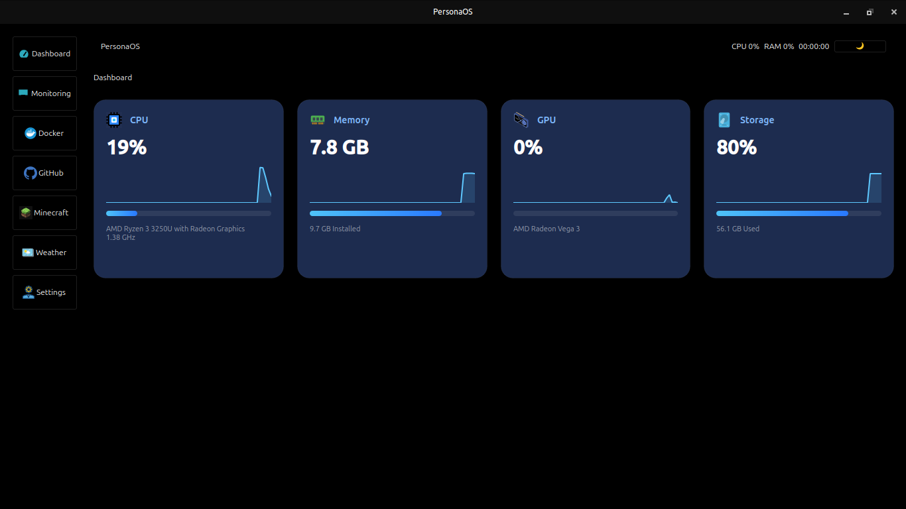

# PersonaOS

A Persona 3 Reload inspired Linux productivity dashboard.

## Features

- Live system monitoring
- Docker integration
- GitHub integration
- Minecraft server dashboard
- Weather widget

## Screenshots

## Documentation

- [Architecture](docs/architecture.md)

## Installation

Coming soon.

# Roadmap

## Version 0.1

- [x] Dashboard
- [x] CPU Monitoring
- [x] RAM Monitoring
- [x] Disk Monitoring
- [x] GPU Monitoring

## Version 0.2

- [ ] Weather Widget
- [ ] GitHub Widget
- [ ] Minecraft Widget
- [ ] Plugin API
- [ ] Notifications

## Version 0.3

- [ ] AI Assistant
- [ ] Theme Editor
- [ ] Widget Marketplace
- [ ] Mobile Companion
